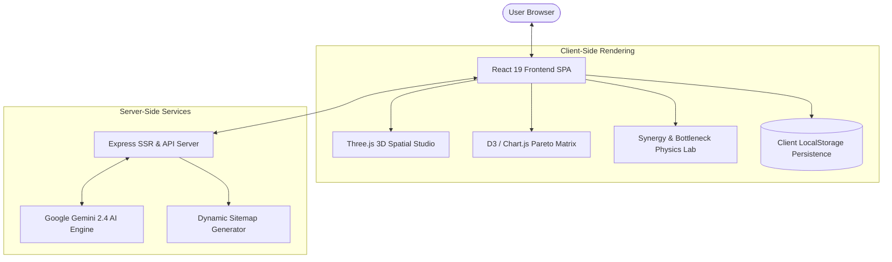

# ⚡ PC Hardware Performance Matrix & Synergy Engine

> **The Ultimate WebGL & AI-Powered Hardware Intelligence Platform** — Real-time 3D PC assembly visualization, Pareto-efficiency price/performance analysis, AI build diagnostics, stability & thermal stress modeling, and total cost of ownership analytics — tailored for high-performance PC building and localized for the Indian market (₹ INR).

<p align="center">
  <a href="https://react.dev/"></a>
  <a href="https://www.typescriptlang.org/"></a>
  <a href="https://vitejs.dev/"></a>
  <a href="https://threejs.org/"></a>
  <a href="https://tailwindcss.com/"></a>
  <a href="https://expressjs.com/"></a>
  <a href="https://ai.google.dev/"></a>
</p>

---

## 🌟 Key Highlights

- 🧊 **3D Spatial Computing & Assembly Studio** — Photorealistic PBR WebGL assembly viewport, interactive exploded component inspect, airflow particle dynamic simulation, and 1:1 scale AR WebXR floor projection.
- 🩺 **AI Build Doctor (Gemini 2.4 Powered)** — Server-assisted natural-language system diagnostic engine with intelligent local heuristics fallback.
- 📊 **Pareto Value Matrix** — Interactive 2D scatter analysis mapping ₹ INR prices against synthetic compute benchmarks across 18 years of hardware history (2007–2025).
- ⚔️ **Architectural Head-to-Head Duel** — 6-axis workload radar charts, lithography details, cache topology, and contextual performance verdicts.
- 🔬 **Synergy & Bottleneck Physics Lab** — Queue-based CPU/GPU frame rendering pipeline analysis at 1080p, 1440p, 4K, and Workstation workloads.
- ⚡ **Thermal & Stability Stress Lab** — High-ambient Indian summer (up to 45°C) thermal runway modeling, Vcore offset & LLC vdroop simulation, and live 15-second stress execution.
- 🖥️ **Rig Architect Configurator** — Real-time component compatibility, VRM/wattage audit, and Indian retail ₹ pricing with 18% GST calculation.
- 🔋 **TCO & DISCOM Electricity Engine** — 3-year running cost projection with region-specific tariffs (MSEDCL, BESCOM, BSES, TANGEDCO, UPPCL, WBSEDCL, WBSEDCL).

---

## 📑 Table of Contents

- [Architectural Overview](#-architectural-overview)
- [Comprehensive Feature Breakdown](#-comprehensive-feature-breakdown)
  - [1. 3D Spatial Computing & Interactive Assembly](#1-3d-spatial-computing--interactive-assembly)
  - [2. AI Build Doctor & Diagnostics Engine](#2-ai-build-doctor--diagnostics-engine)
  - [3. Price-to-Performance Pareto Matrix](#3-price-to-performance-pareto-matrix)
  - [4. Synergy, Bottleneck & Physics Lab](#4-synergy-bottleneck--physics-lab)
  - [5. Rig Architect & Indian Builder Suite](#5-rig-architect--indian-builder-suite)
  - [6. Deep Hardware Labs & Subsystem Simulations](#6-deep-hardware-labs--subsystem-simulations)
- [Tech Stack & Architecture](#-tech-stack--architecture)
- [Project Directory Structure](#-project-directory-structure)
- [Getting Started](#-getting-started)
  - [Prerequisites](#prerequisites)
  - [Installation](#installation)
  - [Development Workflow](#development-workflow)
  - [Production Build & Bundle](#production-build--bundle)
- [Environment Configuration](#-environment-configuration)
- [Performance & Security](#-performance--security)
- [Contributing](#-contributing)
- [License & Trademarks](#-license--trademarks)

---

## 🏗️ Architectural Overview

**PC Hardware Performance Matrix & Synergy Engine** bridges hardware telemetry, CAD-like spatial WebGL modeling, and predictive AI analytics into a unified browser experience. Built as a high-performance Single-Page Application (SPA) leveraging React 19 and Vite 6, it pairs client-side code-split modules with an Express node backend for server-side SEO generation and Gemini AI API orchestration.



---

## 🛠️ Comprehensive Feature Breakdown

### 1. 3D Spatial Computing & Interactive Assembly
- **Exploded View Mechanics**: Smoothly disassembles the chassis along z-axes to inspect RAM slot alignment, AIO pump clearance, motherboard VRM heatspreaders, and GPU sag bracket mountings.
- **Multi-Mode Visual Shading**: Switch instantly between PBR Photorealistic rendering, CAD Wireframe viewports, and Thermal Heat Map overlays.
- **Clearance & Collision Detection**: Real-time bounding-box check identifying RAM height vs. AIO radiator overhangs, GPU length vs. front intake fans, and PSU depth vs. drive cages.
- **Airflow Particle Dynamics**: Visualizes intake/exhaust static pressure loops (positive, neutral, negative flow) and calculates dust-accumulation potential over time.
- **RGB Lighting Sandbox**: Customizable RGB zones supporting presets (*Cyberpunk Cyan, Matrix Emerald, Tokyo Violet*) with dynamic pulse and breathing animations.
- **AR WebXR Floor Projection**: Projects 1:1 scale tower models into physical space via mobile camera viewports.

### 2. AI Build Doctor & Diagnostics Engine
- **Gemini 2.4 Integration**: Processes natural language specs (e.g., *"i5-12400F with RTX 4080 Super for 4K video editing"*) through a secure server-side proxy (`/api/build-doctor`).
- **Heuristic Fallback Engine**: Guarantees zero downtime by switching automatically to local deterministic evaluation rules if API limits or offline modes occur.
- **Diagnostic Insights**: Delivers socket upgrade paths, VRM power phase adequacy ratings, memory bottleneck warnings, and targeted component swap recommendations.

### 3. Price-to-Performance Pareto Matrix
- **Dynamic Frontier Calculation**: Plots 500+ CPU/GPU entries against price point and synthetic compute scores, automatically highlighting non-dominated Pareto optimal parts.
- **Multi-Decade Dataset**: Spans 2007 through 2025, enabling historical value trajectory analysis across legacy and modern architectures.
- **Filters & Direct Routing**: Filter by vendor (NVIDIA, AMD, Intel), release era, TDP envelope, or socket type with single-click routing into the Comparison Duel.

### 4. Synergy, Bottleneck & Physics Lab
- **Resolution-Sensitive Queue Simulation**: Models frame-time rendering breakdown across 1080p, 1440p, 4K, and Ultrawide displays.
- **Adverse Mismatch Alerts**: Detects severe PCIe bus bottlenecks (e.g., PCIe 3.0 x4 limitations on budget GPUs) and core/thread starvation.
- **Stability & LLC Stress Test**: Simulates Load-Line Calibration (LLC) vdroop, 12V transient power spikes, and thermal runaway scenarios under 100% synthetic load runs.
- **Indian Ambient Summer Modeling**: Evaluates thermal throttling under ambient room temperatures up to 45°C for Stock, Air Tower, and 240/360mm AIO coolers.

### 5. Rig Architect & Indian Builder Suite
- **Full 8-Component Configurator**: Interactive selection of CPU, GPU, Motherboard, RAM, Storage, PSU, Cabinet, and Cooling.
- **Automated Validation Engine**: Real-time checking of Socket Compatibility, VRM Thermal Requirements, Total System TDP, and Form-Factor Alignment (ATX, Micro-ATX, Mini-ITX).
- **Indian Retail Localization**: Integrated pricing in ₹ INR including automated 18% GST tax breakdown, vendor availability links, and budget presets from ₹50,000 to ₹2,50,000+.

### 6. Deep Hardware Labs & Subsystem Simulations
- **Silicon Anatomy & Die Inspector**: Detailed floorplans of AMD Zen 4/5 CCDs, Intel Raptor/Arrow Lake compute tiles, and NVIDIA Ada/Blackwell SM layouts.
- **RAM Configuration Lab**: Dual vs. Quad-channel bandwidth, XMP/EXPO timing profiles, sub-timing latency calculations, and infinity fabric ratio impacts.
- **Storage I/O Performance Lab**: Benchmarks sequential and random 4K IOPS across SATA, NVMe Gen3/Gen4/Gen5 SSDs, and legacy mechanical drives.
- **TCO & DISCOM Electricity Engine**: Calculates 3-year ownership expenses using regional tariff tiers (MSEDCL, BESCOM, BSES, TANGEDCO, UPPCL, WBSEDCL) with usage pattern customization.
- **Upgrade ROI Engine**: Quantifies ₹ cost per additional FPS gained and calculates estimated secondary market resale depreciation over 12–36 months.

---

## 💻 Tech Stack & Architecture

| Layer | Technologies & Dependencies | Purpose |
| :--- | :--- | :--- |
| **Core Framework** | [React 19.0](https://react.dev/), [TypeScript 5.8](https://www.typescriptlang.org/) | Concurrent UI rendering & strict type safety |
| **Build System** | [Vite 6.2](https://vitejs.dev/), [tsx](https://github.com/privatenumber/tsx), [Esbuild](https://esbuild.github.io/) | Lightning-fast HMR dev server & production bundling |
| **3D Rendering** | [Three.js v0.186](https://threejs.org/) | WebGL graphics, scene graphs, lighting, & 3D object rendering |
| **Styling & UI** | [Tailwind CSS v4.1](https://tailwindcss.com/), `@tailwindcss/vite` | Modern utility-first responsive styling engine |
| **Animations** | [Motion v12.23](https://motion.dev/) | Fluid layout morphing, modal springs, & page tab transitions |
| **Data Viz** | [Chart.js v4.5](https://chartjs.org/), [D3.js v7.9](https://d3js.org/) | Pareto scatter charts, radar plots, & timeline graphics |
| **Backend & AI** | [Express v4.21](https://expressjs.com/), `@google/genai v2.4` | Server API routes, Gemini AI proxy, and sitemap generation |
| **Utilities** | [jsPDF v4.2](https://github.com/parallax/jsPDF), [canvas-confetti](https://www.npmjs.com/package/canvas-confetti) | Engineering PDF export & gamification reward triggers |

---

## 📁 Project Directory Structure

```
pc-hardware-performance-matrix-synergy-engine/
├── api/                     # Vercel & serverless API endpoints
├── data/                    # Hardcoded hardware specification datasets
├── public/                  # Static assets, icons, manifest files
├── scripts/                 # Post-build routines & dynamic sitemap generators
├── src/                     # React application source code
│   ├── components/          # Feature UI modules
│   │   ├── spatial/         # Three.js 3D viewport scenes & shaders
│   │   ├── AIBuildDoctor.tsx
│   │   ├── HardwareCatalog.tsx
│   │   ├── HeadToHead.tsx
│   │   ├── PerformanceMatrix.tsx
│   │   ├── RigArchitect.tsx
│   │   ├── RunningCostLab.tsx
│   │   ├── Spatial3DStudio.tsx
│   │   └── SynergyLab.tsx
│   ├── data/                # Client hardware catalog index files
│   ├── utils/                # Calculation engines, physics models, cache helpers
│   ├── App.tsx              # Root application router & layout state
│   ├── main.tsx             # React DOM root entry point
│   ├── routes.ts            # Dynamic routing definitions & meta mappings
│   └── types.ts             # TypeScript definitions for hardware models
├── app.ts                   # Express application setup
├── server.ts                # Main Node server entry point
├── package.json             # Build scripts and dependency configuration
├── tsconfig.json            # TypeScript compiler configuration
└── vite.config.ts           # Vite bundler & plugin configuration
```

---

## 🏃 Getting Started

### Prerequisites

Ensure your environment meets the following requirements before installation:
- **Node.js**: `v18.0.0` or higher (v20+ recommended)
- **npm**: `v9.0.0` or higher (or `bun` / `pnpm`)

### Installation

Clone the repository and install dependencies:

```bash
# Clone the repository
git clone https://github.com/theflighttechofficial/RigForge.git

# Navigate to project directory
cd pc-hardware-performance-matrix-synergy-engine

# Install project dependencies
npm install
```

### Development Workflow

Start the development server with hot module replacement (HMR):

```bash
npm run dev
```
> The application will run at **`http://localhost:3000`** (or the port specified in environment configuration).

### Production Build & Bundle

To compile client assets and build the Node server bundle:

```bash
# Generate sitemap, compile React frontend, and bundle Express server
npm run build

# Start production server
npm start
```

Other available scripts:
- `npm run lint` — Runs TypeScript compiler diagnostics (`tsc --noEmit`).
- `npm run sitemap` — Regenerates the dynamic XML sitemap.
- `npm run clean` — Cleans build output directories (`dist/`).

---

## 🔐 Environment Configuration

Create a `.env` file in the project root directory using `.env.example` as a template:

```env
# Optional: Google Gemini API Key for AI Build Doctor natural-language diagnostics
GEMINI_API_KEY=your_gemini_api_key_here

# Optional: Base canonical URL for server-side meta tags and sitemap routing
APP_URL=http://localhost:3000

# Optional: Upstash Redis connection parameters (if caching server responses)
UPSTASH_REDIS_REST_URL=
UPSTASH_REDIS_REST_TOKEN=
```

> **Note**: If `GEMINI_API_KEY` is omitted, the **AI Build Doctor** automatically falls back to its internal deterministic rules engine without throwing errors or breaking UI flows.

---

## ⚡ Performance & Security

- **Lazy-Loaded Modules**: All major lab views and spatial 3D components are code-split using `React.lazy()` and `Suspense`, keeping initial bundle size minimal.
- **Client-First Privacy**: Benchmarks, saved builds, and custom settings persist locally via browser `localStorage`. No user build data is collected or transmitted to external tracking servers.
- **Server API Defense**: The Gemini AI integration is proxied via the Express backend to prevent exposing API credentials on the client side.

---

## 🤝 Contributing

Contributions from hardware enthusiasts and developers are welcome! To contribute:

1. **Fork** the repository.
2. Create a feature branch: `git checkout -b feature/amazing-feature`.
3. Commit your changes: `git commit -m 'Add amazing hardware telemetry feature'`.
4. Push to the branch: `git push origin feature/amazing-feature`.
5. Open a **Pull Request**.

Please ensure your code passes `npm run lint` before submitting PRs.

---

## 📄 License & Trademarks

This project is licensed under the MIT License - see the `LICENSE` file for details.

*Disclaimer: All product names, logos, brands, and trademarks (such as Intel, AMD, NVIDIA, Ryzen, GeForce, Radeon) are property of their respective owners. Their usage in this project is for educational, identification, and hardware performance comparison purposes only.*
